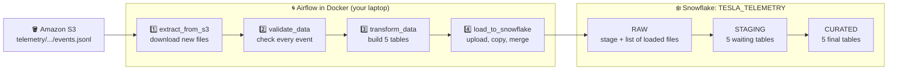
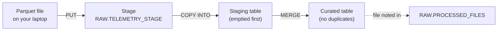

<h1 align="center">Tesla Vehicle Telemetry ETL Pipeline</h1>

<p align="center">
  A beginner-friendly data engineering project that runs end to end on your laptop.<br>
  Raw car events in <b>Amazon S3</b> &rarr; checked and shaped by an <b>Apache Airflow</b> pipeline &rarr; loaded into <b>Snowflake</b>.
</p>

<p align="center">
  
  
  
  
  
</p>

<p align="center">
  
  
  
  
  
</p>

<p align="center">
  <a href="#-quick-start">Quick start</a> &nbsp;&bull;&nbsp;
  <a href="#-how-it-works">How it works</a> &nbsp;&bull;&nbsp;
  <a href="#-your-secrets-stay-private">Secrets</a> &nbsp;&bull;&nbsp;
  <a href="docs/SETUP_GUIDE.md">Setup guide</a> &nbsp;&bull;&nbsp;
  <a href="docs/PROJECT_EXPLAINED.md">Full explanation</a>
</p>

---

## 📌 What this project does

Electric cars send small messages all day: speed, battery, GPS position and alerts. We call each message an **event**.

1. The events are saved as JSONL files in an **S3 bucket**.
2. An **Airflow** pipeline downloads the new files and checks every event.
3. It builds **5 report tables** with pandas and saves them as Parquet files.
4. It loads the tables into **Snowflake** and remembers which files it already loaded.

This kind of pipeline is called **ETL**: Extract, Transform, Load.
Every code file has a plain-English comment above almost every line, so you can read it like a lesson.

---

## 🏗️ How it works



**Inside Snowflake**, each run loads the data in 4 small moves:



A second run finds no new files, so all 4 tasks are **skipped** and nothing is loaded twice.

---

## 🧰 What you need

| | Tool or account | Why |
| :-: | --- | --- |
| ☁️ | AWS account | S3 bucket for raw files, and one read-only IAM user |
| ❄️ | Snowflake account (free trial works) | the data warehouse |
| 🐍 | Python 3.11 | tests and helper commands |
| 🐳 | Docker Desktop (Compose 2.24 or newer) | runs Airflow, nothing else to install |
| 🔐 | openssl | creates your Snowflake login key |
| 💻 | Terminal (Mac), Git Bash (Windows) or Ubuntu/WSL | runs the two scripts |

Step-by-step install and console instructions: **[docs/SETUP_GUIDE.md](docs/SETUP_GUIDE.md)**

---

## 🚀 Quick start

**1. Get the code**

```bash
git clone https://github.com/analyticsdurgesh/tesla-vehicle-telemetry-etl.git
cd tesla-vehicle-telemetry-etl
```

**2. Set up AWS and Snowflake** (about 20 minutes, only once)

Create the S3 bucket, upload `data/sample/tesla_telemetry_sample.jsonl` to
`telemetry/year=2026/month=06/day=06/hour=08/events.jsonl`, and create the IAM user with its read-only policy.
Every click is in [docs/SETUP_GUIDE.md](docs/SETUP_GUIDE.md), section 4.

**3. Add your settings**

```bash
cp .env.example .env
```

Open `.env` and fill in your own 6 values (see [the table below](#-your-secrets-stay-private)).

**4. Run the whole pipeline**

```bash
bash create_pipeline.sh
```

The first time, the script stops at step 5 and prints 2 lines of SQL.
Paste them into a Snowsight worksheet, press **Run All**, then press Enter in the terminal.

**5. Look at the result** ✅

```text
=== STEP 11 of 11: Show the results in Snowflake ===
Rows in the curated tables:
  CURATED.TELEMETRY_ENRICHED          6
  CURATED.VEHICLE_HOURLY_METRICS      3
  CURATED.TRIP_METRICS                2
  CURATED.BATTERY_HEALTH              2
  CURATED.ALERTS                      1
Files already loaded (RAW.PROCESSED_FILES):
  telemetry/year=2026/month=06/day=06/hour=08/events.jsonl  (loaded at ...)

============================================================
 DONE. The pipeline ran end to end.
```

- Airflow: **<http://localhost:8090>** (login `airflow` / `airflow`)
- Snowflake: database **`TESLA_TELEMETRY`**, schema **`CURATED`**

---

## 🔒 Your secrets stay private

All private values live in **one file, `.env`**, on your own laptop. Git ignores it, so it is **never uploaded to GitHub**.
The repo only has the template, [`.env.example`](.env.example).

| Setting | Example | Where you find it |
| --- | --- | --- |
| `AWS_REGION` | `ap-south-1` | the region of your S3 bucket |
| `AWS_ACCESS_KEY_ID` | `AKIA...` | IAM user > Security credentials |
| `AWS_SECRET_ACCESS_KEY` | `wJalr...` | shown once, when you create the key |
| `S3_BUCKET` | `tesla-telemetry-raw-123456789012` | your bucket name |
| `SNOWFLAKE_ACCOUNT` | `ABCDEFG-XY12345` | Snowsight > your name > Account > View account details |
| `SNOWFLAKE_USER` | `STUDENT1` | your Snowflake login name |

> [!IMPORTANT]
> These are never uploaded (see [`.gitignore`](.gitignore)):
> - `.env` with your AWS key and Snowflake account
> - `.secrets/` with your Snowflake private key (created by the script)
> - `.venv/` and `build/` (created on your laptop)
>
> When you share this project with someone, do not send your `.env` or `.secrets/` folder. Each person creates their own.

> [!TIP]
> The pipeline logs in to Snowflake with a **key pair**, not a password. The AWS user can only **read** the `telemetry/` folder of one bucket. If a key ever leaks, the damage is small, but create a new key anyway.

---

## ⌨️ Commands

| Command | What it does |
| --- | --- |
| `bash create_pipeline.sh` | build everything and run the pipeline once (safe to run again) |
| `bash remove_pipeline.sh` | remove Snowflake objects, Airflow, generated files and `.venv` (keeps `.env` and your key) |
| `bash remove_pipeline.sh --everything` | same, and also delete `.env`, your key and the Docker images |
| `docker compose down` | only stop Airflow |
| `docker compose logs airflow-scheduler` | read the Airflow logs if a task fails |
| `.venv/bin/python -m pytest` | run the unit tests (Windows: `.venv/Scripts/python.exe -m pytest`) |

<details>
<summary><b>What <code>create_pipeline.sh</code> does, step by step</b></summary>

| Step | What happens |
| :-: | --- |
| 1 | checks Python, Docker and openssl |
| 2 | checks that `.env` is filled in (creates it from the template the first time) |
| 3 | creates `.venv` and installs the libraries |
| 4 | creates your Snowflake key (first time only) |
| 5 | checks that Snowflake accepts the key, and shows the SQL to register it if not |
| 6 | runs the unit tests |
| 7 | checks that the raw file is in S3 |
| 8 | creates the Snowflake warehouse, database, schemas, tables and procedure |
| 9 | starts Airflow in Docker |
| 10 | runs the DAG once and waits for it to finish |
| 11 | prints the row counts from Snowflake |

</details>

<details>
<summary><b>What <code>remove_pipeline.sh</code> does, step by step</b></summary>

| Step | What happens |
| :-: | --- |
| 1 | drops the Snowflake database `TESLA_TELEMETRY` and warehouse `TELEMETRY_WH` |
| 2 | stops Airflow and deletes its containers and data (`--everything`: also the images) |
| 3 | deletes `build/` and Python cache folders |
| 4 | deletes `.venv/` |
| 5 | `--everything` only: deletes `.env` and `.secrets/` |
| 6 | prints the AWS console steps to delete the bucket and IAM user |

</details>

---

## 📊 What you get in Snowflake

| Table | One row means | Rows from the sample |
| --- | --- | :-: |
| `CURATED.TELEMETRY_ENRICHED` | one event, plus date, hour, moving, charging and battery band | 6 |
| `CURATED.VEHICLE_HOURLY_METRICS` | one car in one hour | 3 |
| `CURATED.TRIP_METRICS` | one car on one day while moving (distance, speed, Autopilot) | 2 |
| `CURATED.BATTERY_HEALTH` | one car on one day (battery charge and temperature) | 2 |
| `CURATED.ALERTS` | one alert event | 1 |
| `RAW.PROCESSED_FILES` | one S3 file that was already loaded | 1 |

```sql
USE ROLE SYSADMIN;
USE WAREHOUSE TELEMETRY_WH;
SELECT * FROM TESLA_TELEMETRY.CURATED.TRIP_METRICS;
```

---

## 🗂️ Project structure

```text
tesla-vehicle-telemetry-etl/
├── create_pipeline.sh            one script: build everything and run the pipeline
├── remove_pipeline.sh            one script: remove everything again
├── docker-compose.yml            Airflow + Postgres in Docker
├── requirements.txt              Python libraries (exact versions)
├── pytest.ini                    where pytest finds the code and tests
├── .env.example                  template for your private .env file
├── .gitignore / .gitattributes   keep secrets out of Git, keep Unix line endings
│
├── data/sample/                  6 sample events (upload this file to S3)
├── dags/tesla_telemetry_dag.py   the Airflow DAG: 4 tasks in order
├── src/telemetry_etl/
│   ├── config.py                 settings
│   ├── schemas.py                what one event must look like
│   ├── extract.py                E: list and download files from S3
│   ├── quality.py                read files and check data quality
│   ├── transform.py              T: build the 5 report tables
│   └── load.py                   L: load and merge into Snowflake
├── snowflake/
│   ├── 01_create_database.sql    warehouse, database, schemas, stage
│   ├── 02_create_tables.sql      staging, curated and file-list tables
│   ├── 03_create_merge_procedure.sql
│   └── 99_drop_everything.sql
├── scripts/pipeline_helper.py    small helper commands for the two scripts
├── tests/                        unit tests
└── docs/
    ├── SETUP_GUIDE.md            install, AWS console, Snowflake, .env, troubleshooting
    └── PROJECT_EXPLAINED.md      the whole project in order, for learning and teaching
```

---

## 📚 Documentation

| Document | Read it when |
| --- | --- |
| [**SETUP_GUIDE.md**](docs/SETUP_GUIDE.md) | you set up the project for the first time (Mac, Windows or Ubuntu/WSL) |
| [**PROJECT_EXPLAINED.md**](docs/PROJECT_EXPLAINED.md) | you want to understand every step, file and table, or teach it in class |

---

## 🛠️ Common problems

| You see | Do this |
| --- | --- |
| `Docker is not running` | open Docker Desktop, wait, run again |
| `... is not filled in inside .env` | fill in that value in `.env` |
| `JWT token is invalid` | run the 2 SQL lines from step 5 in Snowsight with **Run All** |
| `ensurepip is not available` (Ubuntu/WSL) | `sudo apt install -y python3-venv`, then run again |
| `IllegalLocationConstraintException` | `AWS_REGION` in `.env` must be your bucket's region |
| a red task in Airflow | click the task, open **Logs**, read the last lines |

More answers: [docs/SETUP_GUIDE.md, section 9](docs/SETUP_GUIDE.md#9-if-something-goes-wrong)

---

<p align="center">
  Built for learning data engineering: <b>S3 &middot; Airflow &middot; pandas &middot; pydantic &middot; Parquet &middot; Snowflake</b>
</p>
